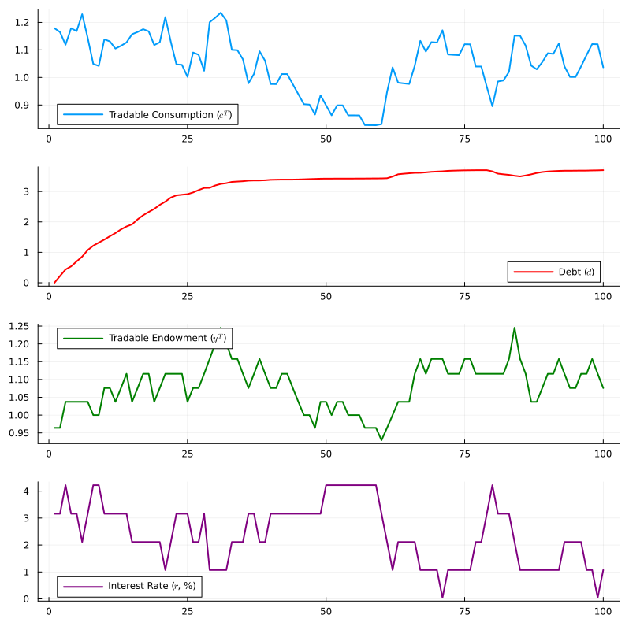

# Introduction

This project extends the open-economy framework developed by @SGU2016 by incorporating a dual labor market featuring both formal and informal sectors. In the original model, downward nominal wage rigidity (DNWR) combined with a currency peg leads to involuntary unemployment during economic contractions. By introducing an informal sector with flexible wage, we provide a buffer that absorbs displaced formal workers, altering the adjustment dynamics and the severity of the externality.

Ideally, I want the model to explain the anticyclical behavior of informality in emerging economies, which depends on the externality introduced by the exchange rate peg using this structure. However, as an initial exercise, I reproduce the optimal exchange rate policy regime from the original model with this altered version, which is simpler to use the tools learned in the course. Under this policy regime, the central bank implements state-contingent currency devaluations to completely offset the DNWR friction, ensuring full employment in the formal market. Therefore, the model simplifies to an infinite-horizon stochastic dynamic programming problem.

# Model

::: {.callout-note}
This model is different from the one presented in class. I simplified the labor market decision with an inelastic labor supply split between formal and informal labor: $\bar{h} = h_{F,t} + h_{I,t}$.

You can check the complete characterization of the model in @sec-appendix. 
:::

Consider a small open economy with tradable and nontradable goods, formal and informal labor, and exogenous shocks to tradable endowment ($y^T$) and interest rates ($r$). 

The economy consists of:

- A representative household that consumes a CES aggregate of tradable goods ($c^T_t$) and nontradable goods ($c^N_t$). They have access to an endowment of tradable goods ($y^T$) and supply both formal ($h_{F}$) and informal ($h_{I}$) labor.
- Competitive firms producing nontradable goods ($y^N$) using both forms of labor.
- A monetary authority that determines the exchange rate policy. Here, we only consider the case of an optimal exchange rate policy, in which the authority sets the exchange rate to guarantee full employment.

## Labor Allocation
Under the optimal exchange rate policy, the central bank ensures that the nominal wage constraint never binds in real terms. As a result, households seamlessly arbitrage between the formal and informal sectors until real wages equalize ($w_{F,t} = w_{I,t}$).

Given a fixed aggregate labor endowment $\bar{h}$, and a Cobb-Douglas nontradable production function $y^N_t = F(h_{F,t}, h_{I,t}) = h_{F,t}^{\alpha_F} h_{I,t}^{\alpha_I}$, the allocation of labor becomes a purely static sub-problem. The social planner maximizes nontradable output each period:
$$
y^{N*} = \max_{h_{F,t}, h_{I,t}} h_{F,t}^{\alpha_F} h_{I,t}^{\alpha_I}
$$
subject to the resource constraint $h_{F,t} + h_{I,t} = \bar{h}$.

The optimal static labor shares are constant fractions of the total endowment, yielding a time-invariant optimal level of nontradable output, $y^{N*}$.

## Dynamic Programming
With $y^{N*}$ constant and the wage friction neutralized, the central planner's problem reduces to choosing the optimal path of tradable consumption and external debt to maximize expected lifetime utility.

The Bellman equation characterizing the optimal policy is:
$$ 
V(y^T_t, r_t, d_t) = \max_{d_{t+1}} \left\{ U(A(c^T_t, y^{N*})) + \beta \mathbb{E}_t \left[ V(y^T_{t+1}, r_{t+1}, d_{t+1}) \right] \right\} 
$$
subject to the resource constraint:
$$
c^T_t + d_t = y^T_t + \frac{d_{t+1}}{1+r_t}
$$
and the debt limit:
$$
d_{t+1} \leq \bar{d} 
$$

Here, $y^T_t$ is the stochastic tradable endowment, $r_t$ is the world interest rate -- both exogenous -- and $d_t$ is the stock of external debt. 

# Numerical Solution

Because the model lacks a closed-form solution, we rely on numerical approximation. The solution strategy involves applying Value Function Iteration (VFI), which we detail below.

## State Space Discretization

The state vector is given by $S_t = (y^T_t, r_t, d_t)$. We discretize both the exogenous and endogenous state variables so we can use computational methods.

1.  **Exogenous:** 
    Following @SGU2016, we model the joint dynamics of the tradable endowment $y^T_t$ and the interest rate $r_t$ as a stationary bivariate VAR(1) process:
    $$
    \begin{bmatrix} 
    \ln(y^T_t) \\ \ln\left(\frac{1+r_t}{1+r_{ss}}\right) 
    \end{bmatrix} = A 
    \begin{bmatrix} 
    \ln(y^T_{t-1}) \\ \ln\left(\frac{1+r_{t-1}}{1+r_{ss}}\right) 
    \end{bmatrix} + \epsilon_t, \quad \epsilon_t \sim \mathcal{N}(0, \Omega)
    $$
    where $A$ is the autocorrelation matrix, $\Omega$ is the covariance matrix of the innovations, and $r_{ss}$ is the steady-state interest rate. 
    
    To map this continuous VAR(1) process into a discrete Markov Decision Process, we implement a custom 2D discretization routine. We first compute the unconditional variance of the process by solving the discrete Lyapunov equation ($V = AVA' + \Omega$) to establish appropriate grid boundaries (e.g., $\pm 3$ standard deviations). We then construct individual grids for income ($N_Y = 21$) and the interest rate ($N_R = 11$), which form a total state space of $N_S = 231$ discrete states. Finally, the $231 \times 231$ transition probability matrix $\Pi$ is populated by evaluating the multivariate normal PDF at the grid nodes and normalizing the rows.
    
    This allows the model to capture the negative correlation between output and borrowing costs in emerging markets.

2.  **Endogenous:**
    For $d_t$, we construct a strictly monotonic grid of $N_D = 501$ points ranging from a maximum savings level $d_{min} = -5$ to the natural borrowing limit $d_{max} = \bar{d} = 8.34$ -- same values from the original paper. 

## Optimization

We employ a continuous choice formulation. The agent is allowed to choose any real value $d_{t+1} \in [d_{min}, d_{max}]$. To evaluate the expected continuation value $\mathbb{E}_t [V(s_{t+1}, d_{t+1})]$ (where $s_{t+1}$ represents the joint realization of income and the interest rate) at points that fall between our grid nodes, we use the `Interpolations.jl` package, choosing either `linear` or `pchip` methods. 

With a continuous objective function, we optimize the Bellman equation using Brent's method via `Optim.jl`, which combines bisection and other methods for fast convergence.

## Value Function Iteration

The iterative procedure to find the fixed point of the Bellman operator over the expanded state space follows these steps:

1.  **Initialization:** Guess an initial value function $V^{(0)}(d, s) = 0$ for all states.

2.  **Expectation Step:** For every current state $s_i = (y^T_i, r_i)$, compute the expected continuation value over all possible next-period composite states $s_j$:
    $$
    EV(d', s_i) = \sum_{j=1}^{N_S} \Pi_{i,j} V^{(n)}(d', s_j)
    $$
    where $N_S = 231$ is the total number of discretized VAR(1) states.

3.  **Maximization Step:** For every state pair $(d_k, s_i)$, solve the constrained optimization problem:
    $$
    V^{(n+1)}(d_k, s_i) = \max_{d' \in [d_{min}, d_{max}]} \left\{ U\left(y^T_i - d_k + \frac{d'}{1+r_i}, y^{N*}\right) + \beta (EV(d', s_i)) \right\}
    $$
    subject to $c^T_t > 0$.

4.  **Convergence Check:** Compute the norm $\Vert V^{(n+1)} - V^{(n)} \Vert_\infty$. If the error is less than the tolerance $\tau = 10^{-6}$, terminate. Otherwise, set $V^{(n)} = V^{(n+1)}$ and return to Step 2.

### Implementation

Because the maximization problem for each state $s_i$ depends only on the expected value from the previous iteration, we can use parallelization. We apply this using Julia's `Threads.@threads` to distribute the outer state-space loop across cores.

The following code block highlights the core maximization step inside the parallelized VFI loop:

```julia
# We parallelize the outer loop over the composite state space (NS = 231)
Threads.@threads for is in 1:gp.NS
    Y_now = Y_grid[is]
    R_now = R_grid[is] # Interest rate is now state-contingent
    
    # [Expectation step EV_next computed here...]
    
    for id in 1:gp.ND
        D_now = Dgrid[id]
        
        # Define objective function for the optimizer
        function objFunc(D_next)
            cT = Y_now - D_now + D_next / (1.0 + R_now)
            if cT < θ.minCons
                return 1e10 # Heavy penalty for negative consumption
            end
            # Interpolate the expected value function
            # using the method in parameters.jl
            val_next = interp1D(Dgrid, EV_next, D_next, gp)
            return -(utility(cT, yN_star, θ) + θ.β * val_next) # - for minimization
        end
        
        # Solve using Brent's Method over the continuous interval
        res = optimize(objFunc, θ.d_min, θ.d_max, Brent())
        
        # Eeach thread writes to a different column
        gD[id, is] = res.minimizer
        V_new[id, is] = -res.minimum
    end
end
```

# Results

By utilizing Julia's `Threads.@threads` macro, we parallelized the state-space loop. Using BenchmarkTools.jl, `@btime` revealed that multi-threading reduced the VFI convergence time around 4 times.

## Simulation

Now we simulate a series of shocks to investigate how the economy behaves. By assuming an optimal exchange rate policy that neutralizes wage rigidities, we have a "first-best" baseline to assess welfare costs of a currency peg in a future exercise. 

The algorithm takes the optimal policy rule (derived in the VFI) and simulates paths. In each quarter, it reads the economy's current state, finds the household's optimal debt choice for tomorrow, computes current consumption via the resource constraint, and uses the Markov transition matrix to draw the exogenous shocks for the following period.

{#fig-sim width=90% fig-align="center"}

The results in @fig-sim illustrate the vulnerability of this economy to boom-bust cycles. Around the middle, the economy is hit by a severe external shock: tradable income hits a deep trough while the interest rate spikes. This reflects the empirical reality of emerging markets, where borrowing conditions for debtors tend to deteriorate when output is low - as highlighted in @SGU2016. As a result, tradable consumption crashes to its lowest point in the simulation. Conversely, as the interest rate plummets and income surges, we see a rapid resurgence in tradable consumption, highlighting the strong procyclicality of domestic absorption.

The external debt trajectory reveals the household's attempts to smooth consumption against these shocks, constrained by the shifting cost of credit. Starting from zero debt, the agent accumulates during the first periods to finance consumption as they transition away from the initial endowment.

However, when the crisis hits, the rising interest rate makes new borrowing expensive, forcing the agent to decrease debt. Because the agents cannot efficiently borrow through the crisis, they absorb the shock through a drastic reduction in consumption. Once the crisis passes ($y^T$ boom), the higher income allows the agent to finance their consumption without requiring further rapid leveraging.

Note that the households would like to smooth consumption ($\sigma = 5$). Therefore, rather than borrowing massively in a single period to reach their target debt, they gradually accumulate debt. Also, the smooth path is a direct consequence of the continuous choice formulation using interpolation, which prevents jumps as in the interest rate.



# References

::: {#refs}
:::

# Appendix {#sec-appendix}

1. Household

The representative household has an aggregate, inelastic labor endowment $\bar{h}$ per period. Because households are wage-takers and prefer higher wages, they will supply labor to the sector with the highest wage.The household maximizes expected lifetime utility:
$$
\mathbb{E}_0 \sum_{t=0}^\infty \beta^t U(c_t) 
$$
where $c_t$ is a CES aggregator of tradable ($c^T_t$) and nontradable ($c^N_t$) consumption:
$$
c_t = A(c^T_t, c^N_t)
$$
The household maximizes utility subject to the following constraints:

Budget Constraint (denominated in tradables):
$$
c^T_t + p_t c^N_t + d_t \leq y^T_t + w_{F,t} h_{F,t} + w_{I,t} h_{I,t} + \phi_t + \frac{d_{t+1}}{1+r_t}
$$
where $p_t$ is the relative price of nontradables, $d_t$ is the debt level, $y^T_t$ is the exogenous tradable endowment, $w_{F,t}$ and $w_{I,t}$ are the real wages in the formal and informal sectors, and $\phi_t$ are firm profits.

Debt Limit Constraint:
$$
d_{t+1} \leq \bar{d}
$$

Labor Supply Constraints & Rationing:

The household supplies all its labor, constrained by the aggregate endowment:
$$
h_{F,t} + h_{I,t} \leq \bar{h}
$$

Because the household seeks to maximize labor income ($w_{F,t} h_{F,t} + w_{I,t} h_{I,t}$), an arbitrage condition emerges. The household will only supply labor to the informal sector if they cannot secure a formal job, meaning formal work commands a weakly higher wage:

$$
w_{F,t} \geq w_{I,t}
$$

The household takes formal employment $h_{F,t}$ as demand-determined (rationed by firms) whenever the formal wage is artificially high, allocating all residual labor to the informal sector.

2. Firm

A representative firm produces nontradable goods using both formal and informal labor. It operates in a perfectly competitive market and takes the relative price $p_t$ and wages $w_{F,t}, w_{I,t}$ as given.The production function is strictly increasing, concave, and satisfies Inada conditions:
$$
y^N_t = F(h_{F,t}, h_{I,t})
$$

The firm maximizes within-period profits:
$$
\max_{h_{F,t}, h_{I,t}} \phi_t = p_t F(h_{F,t}, h_{I,t}) - w_{F,t} h_{F,t} - w_{I,t} h_{I,t}
$$

The FOCs yield the labor demand equations:
$$
p_t F_F(h_{F,t}, h_{I,t}) = w_{F,t}
$$
$$
p_t F_I(h_{F,t}, h_{I,t}) = w_{I,t}
$$
where $F_F$ and $F_I$ are the marginal products of formal and informal labor, respectively.

3. Equilibrium Conditions

A competitive equilibrium under a fixed exchange rate is a set of processes $\{c^T_t, c^N_t, h_{F,t}, h_{I,t}, w_{F,t}, w_{I,t}, p_t, d_{t+1}, \lambda_t, \mu_t\}_{t=0}^\infty$ satisfying the system:

Consumption & Debt Choice:

1. Marginal utility of tradables:
$$
\lambda_t = U'(A(c^T_t, c^N_t)) A_1(c^T_t, c^N_t) 
$$

2. Euler equation:
$$
\frac{\lambda_t}{1+r_t} = \beta \mathbb{E}_t \lambda_{t+1} + \mu_t 
$$

3. Kuhn-Tucker conditions for debt:
$$
\mu_t \geq 0, \quad \mu_t (d_{t+1} - \bar{d}) = 0 
$$

4. Intratemporal relative price:
$$
p_t = \frac{A_2(c^T_t, c^N_t)}{A_1(c^T_t, c^N_t)}
$$

Market Clearing:

5. Tradables resource constraint (Balance of Payments):
$$
c^T_t + d_t = y^T_t + \frac{d_{t+1}}{1+r_t}
$$

6. Nontradables clearing:
$$
c^N_t = F(h_{F,t}, h_{I,t})
$$

7. Aggregate labor clearing (informal sector absorbs all unallocated labor):
$$
h_{F,t} + h_{I,t} = \bar{h}
$$

Labor Demand:

8. Formal labor demand:
$$
p_t F_F(h_{F,t}, h_{I,t}) = w_{F,t} 
$$

9. Informal labor demand:
$$
p_t F_I(h_{F,t}, h_{I,t}) = w_{I,t} 
$$

Wage Rigidity, Arbitrage, and Slackness (The Corrected Core):

10. Downward Nominal Wage Rigidity (applies only to the formal sector):$$ w_{F,t} \geq \gamma w_{F,t-1} $$

11. Arbitrage / Household preference:$$ w_{F,t} \geq w_{I,t} $$

12. Dual-Market Slackness Condition:$$ (w_{F,t} - \gamma w_{F,t-1})(w_{F,t} - w_{I,t}) = 0 $$

Note: This slackness condition defines the regime switching.
If the formal wage is free to adjust ($w_{F,t} > \gamma w_{F,t-1}$), perfect mobility guarantees wages equalize across sectors ($w_{F,t} = w_{I,t}$).
If a shock hits and the formal wage hits its downward floor ($w_{F,t} = \gamma w_{F,t-1}$), formal workers become rationed. The excess labor floods the informal market, depressing the informal wage, causing a formal wage premium to emerge ($w_{F,t} > w_{I,t}$)